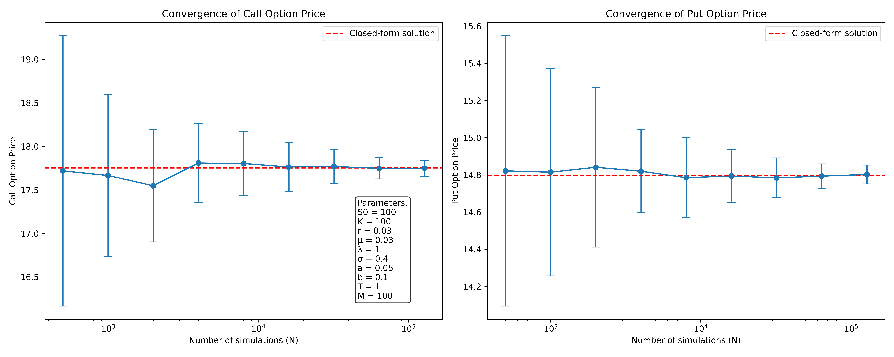

# Merton Jump Diffusion Model

This program aims to implement a simulation of Merton's jump-diffusion model at fixed-dates,
as presented in Paul Glasserman's "Monte Carlo Methods in Financial Engineering" (2003,
Chapter 3.5).The model accounts for both continuous diffusion and discrete jumps in asset prices.

The Glasserman method for simulating the Merton Jump Diffusion model is based on the following stochastic differential equation:

$$
dS(t) = \mu S(t)dt + \sigma S(t)dW(t) + S(t-)dJ(t)
$$

where:
- $S(t)$ is the asset price at time $t$
- $\mu$ is the drift
- $\sigma$ is the volatility
- $W(t)$ is a standard Brownian motion
- $J(t)$ is a compound Poisson process representing jumps

The simulation algorithm for the terminal price $S(T)$ is as follows:

1. Generate $Z \sim N(0,1)$
2. Generate $N \sim \text{Poisson}(\lambda T)$, where $\lambda$ is the jump intensity
3. If $N > 0$, generate $\log Y_1, ..., \log Y_N \sim N(a, b^2)$ and set $M = \sum_{i=1}^N \log Y_i$
4. Calculate $S(T)$ using:

   $$
   S(T) = S(0)\exp\left((r - \frac{1}{2}\sigma^2 - \lambda(e^{a+\frac{1}{2}b^2}-1))T + \sigma\sqrt{T}Z + M\right)
   $$

   where $r$ is the risk-free rate.

The `MertonJumpDiffusionModel` class implements this simulation method in the `simulate_terminal_prices` function. It also includes methods for pricing European options using Monte Carlo simulation (`nested_monte_carlo_option_price`) and a closed-form solution (`closed_form_price`).

The main script generates convergence graphs to compare the Monte Carlo estimates with the closed-form solution for both call and put options.

## Reference

Glasserman, Paul. "Monte Carlo Methods in Financial Engineering," 2003, Springer-Verlag, Chapter 3.5, "Processes with Jumps," pages 134-142.

